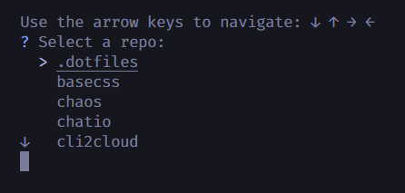
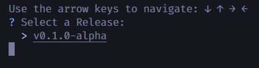
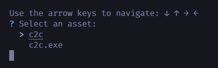

# GPM

```sh
  __ _ _ __  _ __ ___  
 / _` | '_ \| '_ ` _ \ 
| (_| | |_) | | | | | |
 \__, | .__/|_| |_| |_|
 |___/|_|              

A go cli tool for downloading releases from GitHub
```

## USAGE

```sh
gpm
```

This will prompt you for a github username


Then it will prompt you to interactively a public github repository



If you select a repositor that has releases, it will prompt you to select a release



If you select a release that has downloadable assets / binaries, it will prompt you to select a binary to download



The binary will be downloaded to the current directory

## LICENSE

MIT
